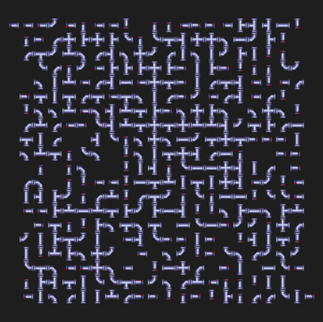
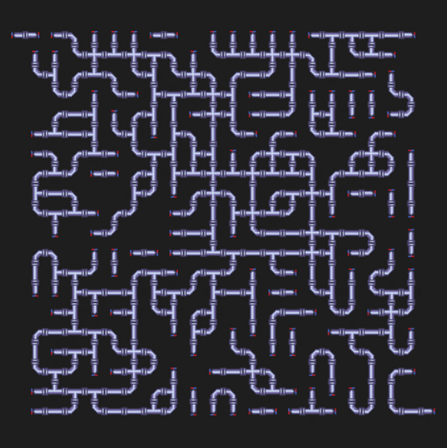

# The Connection Game

An AI-powered puzzle solver for the "Connection" (or Plumber) game. This project generates solvable pipe-connection grids and solves them using search algorithms, informed heuristics, and graph optimization techniques.

<div align="center">
  
  
</div>

## Features

- Puzzle Generation: Creates $n \times m$ grids with guaranteed solvability by starting from a "solved" state and applying controlled randomization.
- Smart Solver: Combines Depth-First Search (DFS) with a "Trivial Cell" deduction engine to prune the search space.
- Problem Decomposition: Uses clustering (via `scipy.ndimage`) to split independent parts of the grid into smaller, manageable sub-problems.
- Bitwise Modeling: Highly efficient state representation using 4 bits per tile (Up, Right, Down, Left).

## Technical Overview

1. Modeling

Each tile is represented by a 4-bit integer representing its connections:
- `1000`: Top (H)
- `0100`: Right (D)
- `0010`: Bottom (B)
- `0001`: Left (G)

The game state is an $(n+2) \times (m+2)$ matrix, including a boundary layer (the "wall"). A safe state is reached when all adjacent bits match (e.g., a tile's "Right" bit must match its neighbor's "Left" bit).

2. Solving Strategy

The solver uses a three-tier approach:

- Trivial Deduction: Before searching, the algorithm identifies tiles with only one possible valid orientation based on their neighbors. This often solves up to 90% of the grid instantly, but is often an overlooked step by many in the resolution of this problem.
- Clustering: The grid is analyzed to find "unsolved clusters." Each cluster is solved independently to avoid an exponential explosion of the search tree.
- Informed DFS: For remaining ambiguities, a DFS explores the state space, prioritized by the "Maximum Safe Connections" heuristic.

## Setup & Installation

Choose the method that matches your environment:

### Google Colab (quickest and simplest method)

You can run this notebook directly in [Google Colab](https://colab.research.google.com), without any local installation :

**Step 1 :** Open [Google Colab](https://colab.research.google.com), and log in with a Google Account if needed.

**Step 2 :** In the `Open notebook` welcoming modal, in the menu on the left, select the `GitHub` option, and enter the following URL in the search bar : `https://github.com/ninolt/connection-game`.

**Step 3 :** Click on the `main.ipynb` file in order to open the project

## Using uv

[`uv`](https://github.com/astral-sh/uv) is a fast Python package manager designed for reproducible environments. It will automatically create and manage an isolated environment for you.

**Step 1 :** In order to install `uv` on your system, you can simply run the following command on MacOS and Linux :

```bash
curl -LsSf https://astral.sh/uv/install.sh | sh
```

and for Windows :

```powershell
powershell -ExecutionPolicy ByPass -c "irm https://astral.sh/uv/install.ps1 | iex"
```

**Step 2 :** In order to both setup your environment an run the program, you can run the following command in your terminal in the project's directory :

```bash
uv run jupyter notebook
```

**Step 3 :** Double-click on the `main.ipynb` file when the Jupyter web page has been opened in your browser.

## Using `pip`

**Step 1 :** Ensure you have **Python 3.13** or higher installed :

```bash
python3 --version
```

**Step 2 :** Create a virtual environment in the project's directory, and activate it :

```bash
python3 -m venv .venv

# For MacOS and Linux
source .venv/bin/activate

# For Windows
.venv\Scripts\activate
```

**Step 3 :** Download and install the required dependencies for the project inside the virtual environment :

```bash
pip install -r requirements.txt
```

**Step 4 :** Simply run the following command in order to start the project :

```bash
jupyter notebook
```

**Step 5 :** Double-click on the `main.ipynb` file when the Jupyter web page has been opened in your browser.

## Performance & Profiling

To visualize the algorithm's performance and bottleneck points:

1. Generate a profile:
```
uv run python -m cProfile -o profile.prof main.py
```

2. Analyze with Snakeviz:
```
uv run snakeviz profile.prof
```

## Testing

The project uses `pytest` to ensure the integrity of bitwise rotations and connection logic:
```
uv run pytest
```
